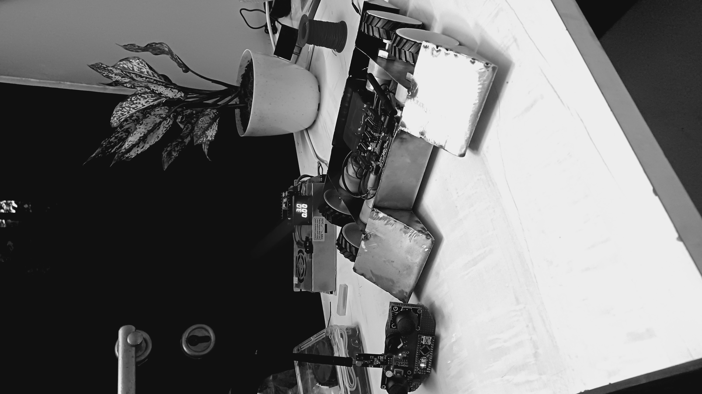

# Robo Soccer Bot — Autonomous Arduino Soccer Robot


> An autonomous Arduino robot that plays soccer — NRF24L01 radio for low-latency control and team coordination.



---

## Overview

A custom-built soccer robot designed for robotics competitions. The robot uses an **Arduino Mega** as the main controller, four mecanum wheels for omnidirectional movement, and an **NRF24L01+** 2.4 GHz radio module for team communication and remote operation.

Two bots can coordinate autonomously — one acts as "attacker," the other as "defender" — by broadcasting positions and strategy flags over the RF link at ~200 Hz.

---

## Hardware

| Component | Detail |
|-----------|--------|
| Controller | Arduino Mega 2560 |
| RF Module | NRF24L01+ (PA+LNA, 2.4 GHz) |
| Motors | N20 gear motors × 4 (300 RPM) |
| Wheels | Mecanum wheels (50mm) |
| Motor driver | L298N × 2 |
| Ball sensor | IR proximity (TCRT5000) |
| IR compass | Pixy2 cam or HMC5883L |
| Power | 3S LiPo 11.1V 1500 mAh |
| Chassis | Custom laser-cut acrylic |

---

## Control Architecture

```
Remote / Autonomous mode
  ↓
NRF24L01 receive (200 Hz polling)
  ↓
Strategy FSM:
  SEEK_BALL → APPROACH → KICK / DEFEND
  ↓
Mecanum kinematics → motor PWM
```

**Mecanum kinematics** — four-wheel omnidirectional drive allows the bot to strafe, rotate in place, and move diagonally without turning, which is critical for reacting to ball position changes.

```
vx = joystick_x (strafe)
vy = joystick_y (forward/back)
ω  = joystick_rotation

FL = vy + vx + ω
FR = vy - vx - ω
RL = vy - vx + ω
RR = vy + vx - ω
```

---

## RF Communication

Two bots pair on startup via NRF24L01 address assignment. Each bot broadcasts a 12-byte packet every 5 ms:

```c
struct Packet {
  uint8_t  role;       // ATTACKER or DEFENDER
  int16_t  ball_x;     // Ball position estimate
  int16_t  ball_y;
  uint8_t  has_ball;   // IR sensor flag
  uint8_t  battery;    // Voltage in 0.1V steps
  uint8_t  checksum;
};
```

If a packet is missed for >50 ms, the bot switches to autonomous solo mode.

---

## Autonomous Behaviour

The FSM has four states:

| State | Trigger | Action |
|-------|---------|--------|
| IDLE | Start / no ball | Spin in place, scanning |
| SEEK | Ball not in reach | Navigate toward ball |
| DRIBBLE | Ball in IR range | Move toward goal |
| DEFEND | Partner has ball | Position at goal line |

Role assignment is negotiated at startup — whichever bot detects the ball first becomes attacker.

---

## Setup

```bash
git clone https://github.com/kavinjainn/robo-soccer

# Open in Arduino IDE
# Board: Arduino Mega 2560
# Required libraries:
#   RF24          (NRF24L01 driver)
#   Servo         (built-in)
#   Wire          (built-in)
```

Flash `src/robot/robot.ino` to each bot. Change `#define BOT_ID` to `0` or `1` for attacker/defender.

---

## About

Built by [Kavin Jain](https://kavinjain.in) for inter-school robotics competitions in Udaipur.
